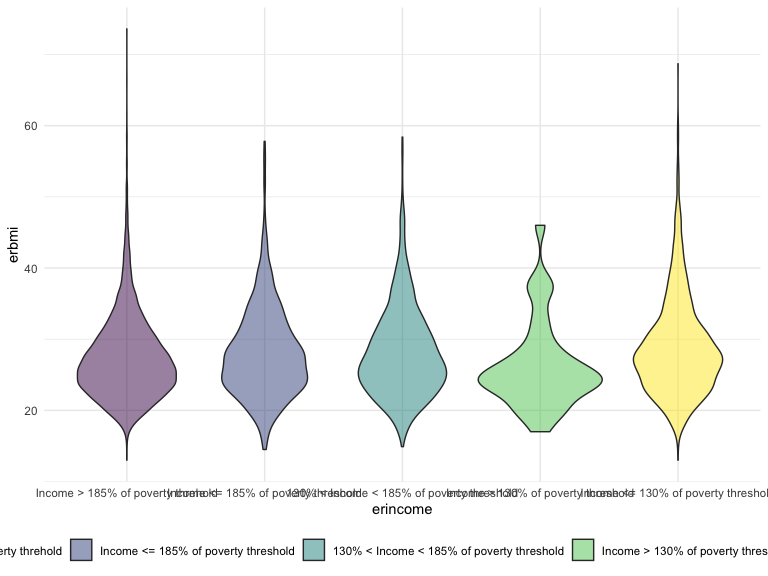

basic plot
================
Shane
2020-12-04

# Basic

``` r
raw_eathealth = read.csv("ehresp_2014.csv") %>%
  mutate(
    tucaseid = as.factor(tucaseid)
  ) %>%
  select(tucaseid, starts_with(c("er", "eu")), -erhhch)
```

``` r
desc_eathealth = raw_eathealth %>%
  select(erbmi, euwgt, euhgt, erincome) %>%
  filter_all(all_vars(. > 0)) %>%
  mutate(
    erincome = factor(erincome, labels = c("Income > 185% of poverty threhold", "Income <= 185% of poverty threshold",
                                           "130% < Income < 185% of poverty threshold",
                                           "Income > 130% of poverty threshold", "Income <= 130% of poverty threshold"))
  )
```

``` r
external_indicators = raw_eathealth %>%
  select(erbmi, eugenhth, erincome, eustores) %>%
  filter_all(all_vars(. > 0)) %>%
  rename("physical_health" = "eugenhth") %>%
  mutate(
    physical_health = factor(physical_health, labels = c("Excellent", "Very Good", "Good", "Fair", "Poor")),
     erincome = factor(erincome, labels = c("Income > 185% of poverty threhold", "Income <= 185% of poverty threshold",
                                           "130% < Income < 185% of poverty threshold",
                                           "Income > 130% of poverty threshold", "Income <= 130% of poverty threshold")),
    eustores = factor(eustores, labels = c("Grocery Store", "Supercenter", "Warehouse Club", 
                                           "Drugstore or Convenience Store", "Some Other Place"))
  )

internal_indicators = raw_eathealth %>%
  select(erbmi, eugenhth, eufastfdfrq, euexfreq) %>%
  filter_all(all_vars(. > 0)) %>%
  rename("physical_health" = "eugenhth") %>%
  mutate(
    physical_health = factor(physical_health, labels = c("Excellent", "Very Good", "Good", "Fair", "Poor")))
```

# Add-ons

``` r
desc_eathealth %>% 
  ggplot(aes(x = erincome, y = erbmi)) + 
  geom_violin(aes(fill = erincome), alpha = .5)
```


