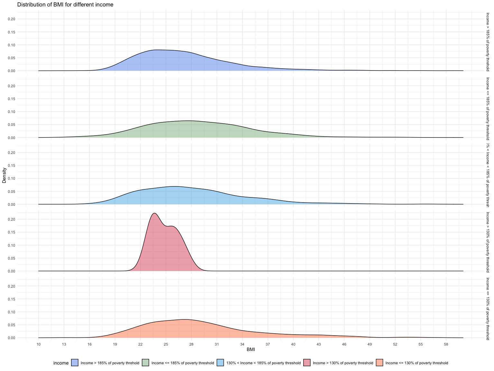
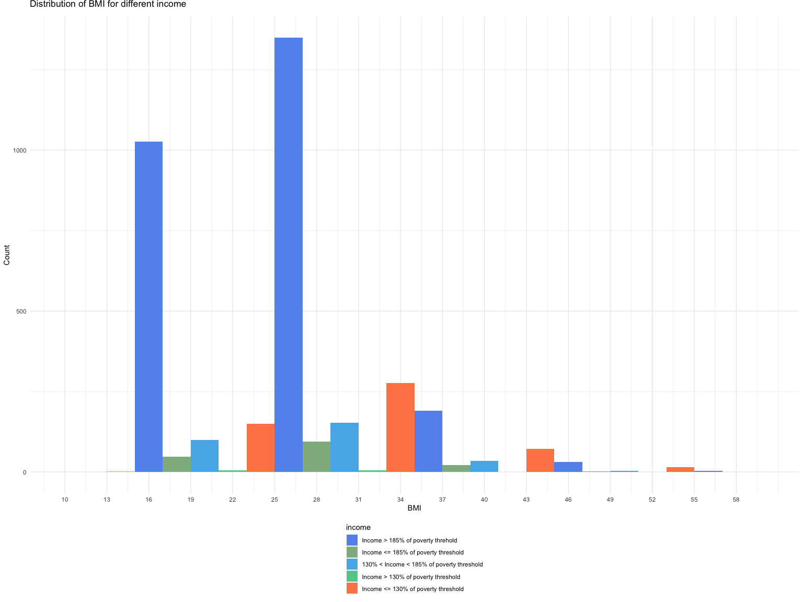
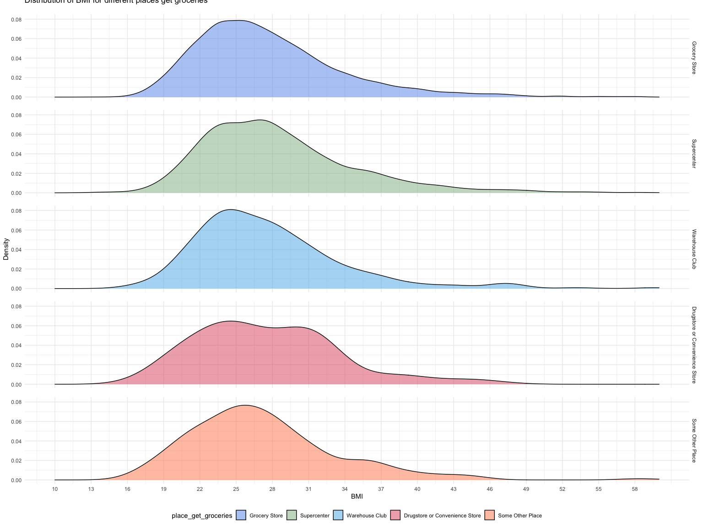
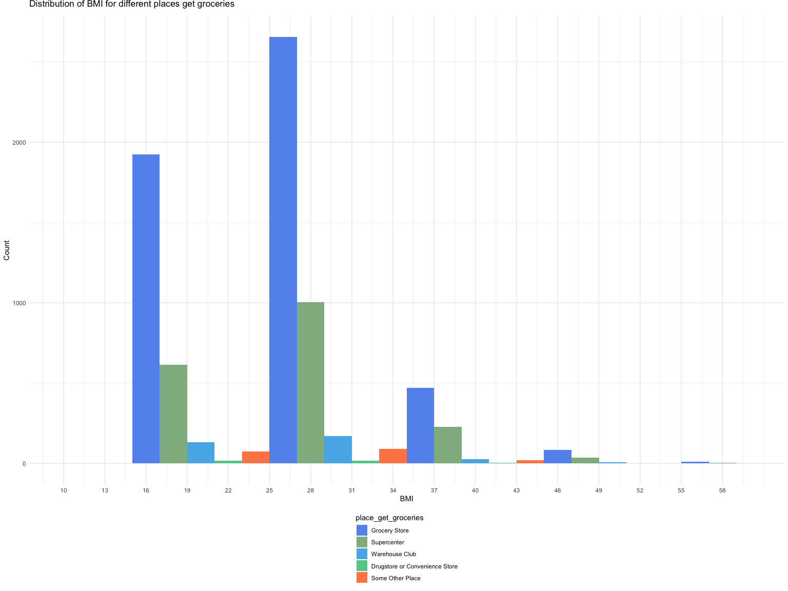
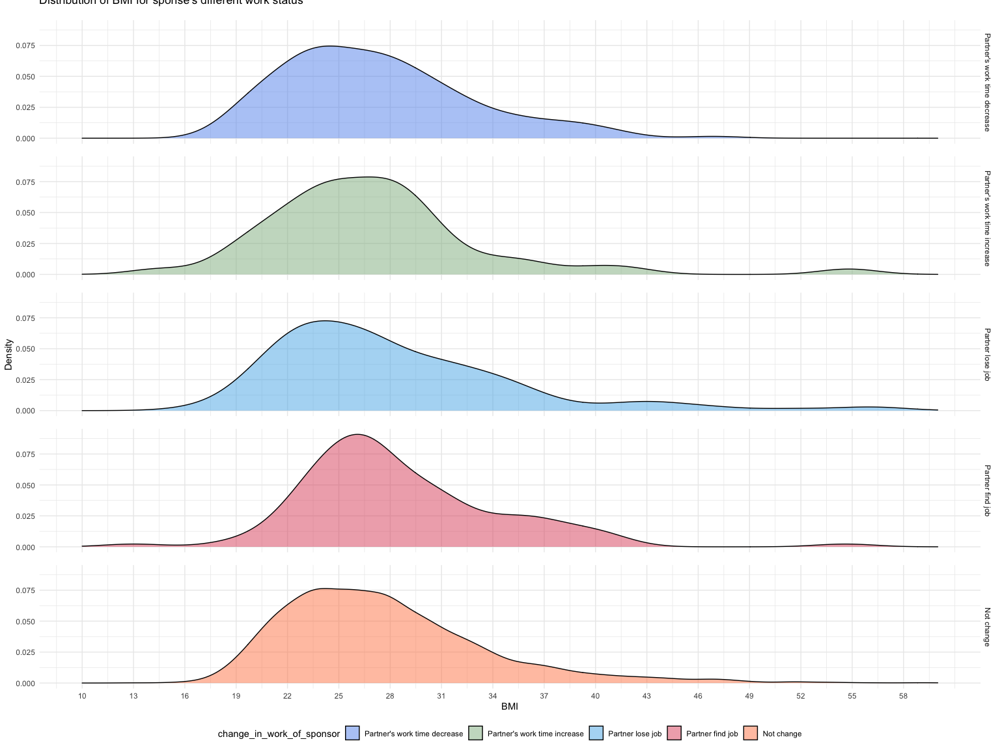
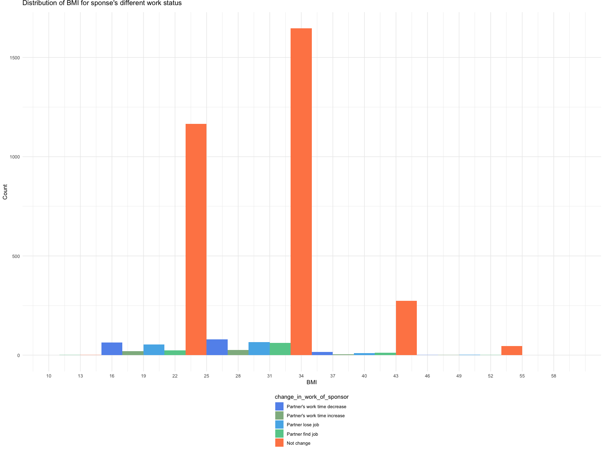

association\_plots
================

# the association between external factors :

data cleaning

``` r
raw_eathealth = read.csv("ehresp_2014.csv") %>%
  mutate(
    tucaseid = as.factor(tucaseid)
  ) %>%
  select(tucaseid, starts_with(c("er", "eu")), -erhhch)
```

``` r
external_indicators_two = raw_eathealth %>%
  select(erbmi, eugenhth, erincome, eustores,erspemch) %>%
  filter_all(all_vars(. > 0)) %>%
  rename("physical_health" = "eugenhth") %>%
  mutate(
    physical_health = factor(physical_health, labels = c("Excellent", "Very Good", "Good", "Fair", "Poor")),
     erincome = factor(erincome, labels = c("Income > 185% of poverty threhold", "Income <= 185% of poverty threshold", "130% < Income < 185% of poverty threshold", "Income > 130% of poverty threshold", "Income <= 130% of poverty threshold")),
    eustores = factor(eustores, labels = c("Grocery Store", "Supercenter", "Warehouse Club", 
                                           "Drugstore or Convenience Store", "Some Other Place")),
    erspemch = factor(erspemch, labels = c("Partner's work time decrease", "Partner's work time increase", "Partner lose job","Partner find job", "Not change" ))
       )%>%
rename("bmi"="erbmi", "income"="erincome","place_get_groceries" ="eustores","change_in_work_of_sponsor" = "erspemch")
```

\#income and bmi

``` r
plot_inc_bmi_one=
external_indicators_two %>%
ggplot(aes(x=bmi,fill = income))+geom_density(alpha=0.5)+facet_grid(income~.)+scale_x_continuous( breaks = seq(10,60,3),limits =c(10,60))+labs( title = "Distribution of BMI for different income", x = "BMI", y="Density")+theme(legend.position = "bottom",panel.spacing = unit(0.5, "lines"))+scale_fill_manual(values=c("#6495ED","#8FB78F","#56B4E9","66cc99","#FF8754"))
plot_inc_bmi_one
```

<!-- -->

``` r
plot_inc_bmi_two=
external_indicators_two %>%
ggplot(aes(x=bmi,fill = income)) +geom_histogram(position = "dodge", binwidth = 10)+scale_fill_manual(values=c("#6495ED","#8FB78F","#56B4E9","#66cc99","#FF8754"))+scale_x_continuous( breaks = seq(10,60,3),limits =c(10,60))+labs( title = "Distribution of BMI for different income", x = "BMI", y="Count")+theme(legend.position="bottom",legend.direction="vertical", plot.title = element_text(vjust = 3), panel.spacing = unit(0.5, "lines"))

plot_inc_bmi_two
```

<!-- -->

\#- Groceries + BMI (EUSTORES + ERBMI) - Plot

``` r
plot_stor_bmi_one=
external_indicators_two %>%
ggplot(aes(x=bmi,fill = place_get_groceries))+geom_density(alpha=0.5)+facet_grid(place_get_groceries~.)+scale_x_continuous( breaks = seq(10,60,3),limits =c(10,60))+labs( title = "Distribution of BMI for different places get groceries", x = "BMI", y="Density")+theme(legend.position = "bottom", plot.title = element_text(vjust = 5),panel.spacing = unit(1, "lines"))+scale_fill_manual(values=c("#6495ED","#8FB78F","#56B4E9","66cc99","#FF8754"))
plot_stor_bmi_one
```

<!-- -->

``` r
plot_stor_bmi_two=
external_indicators_two %>%
ggplot(aes(x=bmi,fill = place_get_groceries)) +geom_histogram(position = "dodge", binwidth = 10)+scale_fill_manual(values=c("#6495ED","#8FB78F","#56B4E9","#66cc99","#FF8754"))+scale_x_continuous( breaks = seq(10,60,3),limits =c(10,60))+labs( title = "Distribution of BMI for different places get groceries ", x = "BMI", y="Count")+theme(legend.position="bottom",legend.direction="vertical", plot.title = element_text(vjust = 3),panel.spacing = unit(1.5, "lines"))

plot_stor_bmi_two
```

<!-- -->

\#household conditions+BMI

``` r
plot_spou_bmi_one=
external_indicators_two %>%
ggplot(aes(x=bmi,fill = change_in_work_of_sponsor))+geom_density(alpha=0.5)+facet_grid(change_in_work_of_sponsor~.)+scale_x_continuous( breaks = seq(10,60,3),limits =c(10,60))+labs( title = "Distribution of BMI for sponse's different work status", x = "BMI", y="Density")+theme(legend.position = "bottom", plot.title = element_text(vjust = 5),panel.spacing = unit(1, "lines"))+scale_fill_manual(values=c("#6495ED","#8FB78F","#56B4E9","66cc99","#FF8754"))
plot_spou_bmi_one
```

<!-- -->

``` r
plot_spou_bmi_two=
external_indicators_two %>%
ggplot(aes(x=bmi,fill = change_in_work_of_sponsor)) +geom_histogram(position = "dodge", binwidth = 10)+scale_fill_manual(values=c("#6495ED","#8FB78F","#56B4E9","#66cc99","#FF8754"))+scale_x_continuous( breaks = seq(10,60,3),limits =c(10,60))+labs( title = "Distribution of BMI for sponse's different work status ", x = "BMI", y="Count")+theme(legend.position="bottom",legend.direction="vertical", plot.title = element_text(vjust = 3),panel.spacing = unit(1.5, "lines"))

plot_spou_bmi_two
```

<!-- -->
